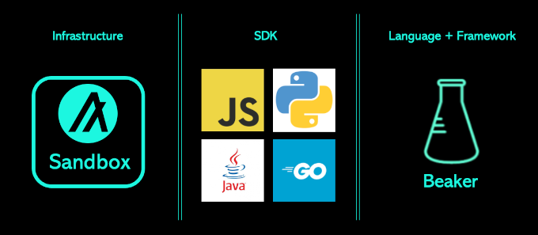
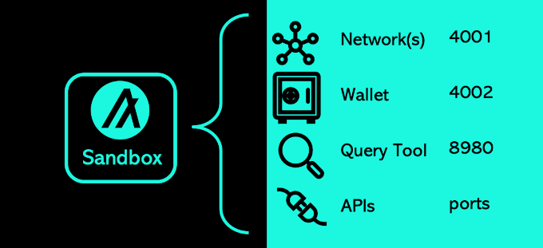

# Algorand Developer Bootcamp

## Video
- [Session #1](https://youtu.be/5O1-mqCGcc0)

## Componentes - Developer Environment


## Developer Environment Pre-requisitos

- Python 3.10+ ([https://python.org](https://python.org))
- Docker Desktop 4.8.0+ ([https://docker.com](https://docker.com))
- Windows only: WSL2 ([https://learn.microsoft.com/en-us/windows/wsl/install](https://learn.microsoft.com/en-us/windows/wsl/install))

## Sandbox
Algorand Sandbox provee la infraestructura de Aglorand para correrlo localmente dentro de su entorno de desarrollo. Las redes incluidas, wallet y las herramientas de consultas, provee endpoints REST API para interactuar con su SDK y aApp.



### Instalación
Abra una nueve terminal y navegue hasta el directorio deseado.
```
git clone https://github.com/algorand/sandbox
cd sandbox
```

### Levandando una red local privada de Algorand

> :information_source: **Recomendación**
> Developers deben empezar su proceso de desarrollo usando una red local privada. Consulte la sección posterior para iniciar y sincronizar una red pública de Algorand.

```
./sandbox up dev -v
```

Sandbox en _dev mode_ provee la siguiente infraestructura de componentes:

| Tool | Description | 
| ---- | ----------- | 
| `algod` | ledger nodes |
| `goal` | CLI tool + transaction builder |
| `kmd` | wallet (key manager) | 
| `indexer` | blockchain queries | 

> :information_source: **Nota**
> `indexer` **no** es provista cuando Sandbox es levantado en una red de Algorand  _publica_. Utilizar un proveedor en este caso.

#### Cuentas Default
Sandbox corriendo como una _red privada local_ provee tres (3) cuentas por default cuando la red es inizialidada. Se puede visualizar estas cuentas en cualquier momento con el siguiente comando:
```
./sandbox goal account list
```
Ejemplo output:
```
[online]    QYL3G7H63N3JUH6LUX3LPHWOW6AT2XYQ6GD4E3OP7KBTFKWXGTF7FW3VM4  QYL3G7H63N3JUH6LUX3LPHWOW6AT2XYQ6GD4E3OP7KBTFKWXGTF7FW3VM4  4000000000000000 microAlgos
[online]    RCJBNCQOMRBBBDG4TEVOYKUQMCFMLZ2RUWBQP3HARYBJRH5YBYRP52MFKI  RCJBNCQOMRBBBDG4TEVOYKUQMCFMLZ2RUWBQP3HARYBJRH5YBYRP52MFKI  4000000000000000 microAlgos
[online]    457AGKGZUM5QC5ESLXMGL5YD3I2A7MJDRNPYFBHKJ3PGLZMS4SQYXQBMOE  457AGKGZUM5QC5ESLXMGL5YD3I2A7MJDRNPYFBHKJ3PGLZMS4SQYXQBMOE  2000000000000000 microAlgos
```

> :information_source: **Nota**
>Estas cuentas pre-fondeadas se almacenan dentro de la wallet predeterminada mantenida por `kmd`

Configure variables de entorno para cuentas por default para su uso vía CLI: 
```
ADDR1=$(./sandbox goal account list | awk 'FNR==1{ print $2 }')
ADDR2=$(./sandbox goal account list | awk 'FNR==2{ print $2 }')
ADDR3=$(./sandbox goal account list | awk 'FNR==3{ print $2 }')
```

Vea un _Registro de Balance_ usando:
```
./sandbox goal account dump --address $ADDR1
```

#### Primerta transacción
Envíe su primera transacción usando el comando `goal`:

```
./sandbox goal clerk send --amount 123456789 --from $ADDR1 --to $ADDR2
./sandbox goal account dump --address $ADDR1
```

> :information_source: **Nota**
>el `--amount` flag especifica la unidad de microAlgos. 1 ALGO es 1_000_000 microAlgo.


#### Consulta de transacciones confirmadas
Usar `curl` para consultar el Indexer para todas las transacciones:

```
curl "localhost:8980/v2/transactions?pretty"
```

## REST APIs

### algod node

Sandbox provee `goal` como herramienta de consola principal para el desarrollo, enviando y firmando transacciones. Los SDK proveen clientes a `algod` para acceder [REST APIs](https://developer.algorand.org/docs/rest-apis/algod/v2/) usando:

- Address: `http://localhost:4001` 
- Token: `aaaaaaaaaaaaaaaaaaaaaaaaaaaaaaaaaaaaaaaaaaaaaaaaaaaaaaaaaaaaaaaa`

### KMD wallet
Sandbox provee `kmd` el _key management daemon_ para almacenar claves privadas y firmar transacciones. Los SDK proveen clientes para acceder [REST APIs](https://developer.algorand.org/docs/rest-apis/kmd/) usando:

- Address: `http://localhost:4002` 
- Token: `aaaaaaaaaaaaaaaaaaaaaaaaaaaaaaaaaaaaaaaaaaaaaaaaaaaaaaaaaaaaaaaa`

> :information_source: **Nota**
> `goal` arrancaré automaticamente `kmd` cuando se requiera una transacción de firma. Los clientes del SDK se deben assegurar que `kmd` esta disponible para acceder a las REST APIs.

### Indexer
Sandbox provides `indexer` as the primary query tool for committed blockchain data. SDKs provide clients for accessing [REST APIs](https://developer.algorand.org/docs/rest-apis/indexer/) using:

Sandbox provee `indexer` como la herramienta de consultas principal de datos confirmados en la blockchain. Los SDK proveen clientes para acceder [REST APIs](https://developer.algorand.org/docs/rest-apis/indexer/) usando:

- Address: `http://localhost:8980`

> :information_source: **Nota**
> No se requiere un _token_

## Sincronización con redes publicas de Algorand

Sandbox may be used to connect to the public Algorand `BetaNet` or `TestNet` or `MainNet` for deployments and limited testing. Sandbox is not supported for production infrastructure environments. Connect to `TestNet` using:

Sandbox se puede usar para conectarse a la red publica de Algorand `BetaNet` o `TestNet` o `MainNet` para deploys y testing limitado. Sandbox no es compatible con entornos de producción. Conectese a `TestNet` usando:

```
./sandbox up testnet -v
```
> :information_source: **Notice**
> El Indexer no esta disponible cuando Sandbox es conectado a la red pública.

## SDKs
Algorand provee SDKs en cuatro lenguajes:
- [Python](https://developer.algorand.org/docs/sdks/python/#install-sdk)
- [JavaScript](https://developer.algorand.org/docs/sdks/python/#install-sdk)
- [Java](https://developer.algorand.org/docs/sdks/java/#install-sdk-for-runtime)
- [Go](https://developer.algorand.org/docs/sdks/python/#install-sdk)

[La comunidad de Algorand soporta SDKs](https://developer.algorand.org/ecosystem-projects/?tags=sdk) que estan disponibles en otros lenguajes.